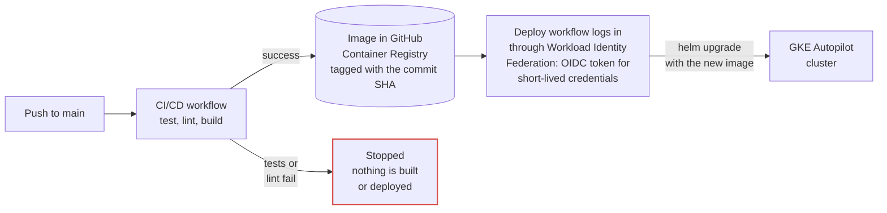
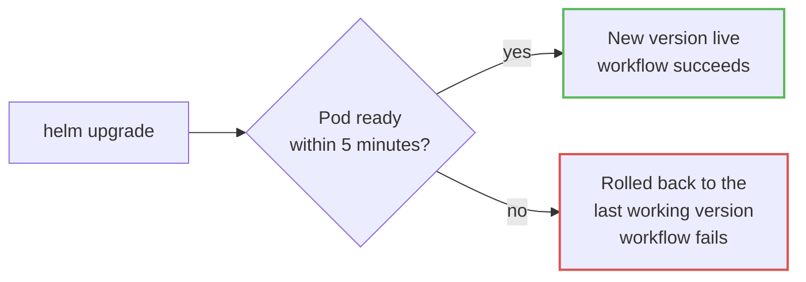
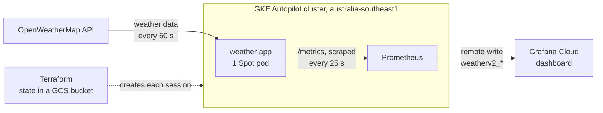

# Weather Metrics v2

A weather metrics service running on **Google Kubernetes Engine**, with infrastructure defined in **Terraform**, the application packaged with **Helm**, and deploys from **GitHub Actions** that use no stored cloud credentials.

The service fetches current weather for London, Auckland and New York every 60 seconds, exposes it as Prometheus metrics, and feeds a Grafana Cloud dashboard. The whole environment is built from code at the start of a session and destroyed at the end, so it costs almost nothing when idle.


## Contents

1. [The story](#the-story)
2. [Highlights](#highlights)
3. [Architecture](#architecture)
   - [Build and deploy](#build-and-deploy)
   - [Rollout](#rollout)
   - [Runtime](#runtime)
4. [Cost](#cost)
5. [What changed since v1](#what-changed-since-v1)
6. [Tech stack](#tech-stack)
7. [Repository layout](#repository-layout)
8. [Running it](#running-it)
   - [Locally](#locally)
   - [On GKE](#on-gke)

## The story

**v1** is a FastAPI service on a single Oracle Cloud VPS, run with Docker Compose and deployed by GitHub Actions over SSH with a stored key. It is still live, with a public Grafana dashboard and alert rules, in [v-galkin/weather-metrics](https://github.com/v-galkin/weather-metrics). It was not changed at any point while building v2.

**v2** set out to run the same service the way a platform team would: on Kubernetes, reproducible from code, deployed without long-lived secrets, and cheap enough to run on a free trial. It was built in five stages:

1. **Fixing v1 first.** A review of the v1 code found eleven problems, from a public endpoint that let anyone create metric series to a single bad API response stopping every city from updating. The code fixes were written test first, and the test suite grew from 14 to 26 tests. Each problem, its fix and how it was verified are described in [docs/changes-from-v1.md](docs/changes-from-v1.md).
2. **Infrastructure as code.** Terraform creates the network, the GKE Autopilot cluster and the identity that GitHub Actions uses. The identity is permanent; the cluster is created and destroyed every session.
3. **Packaging and observability.** A Helm chart runs the app with separate liveness and readiness checks and a non-root security context. Prometheus runs in the cluster and forwards only the application metrics to Grafana Cloud.
4. **Keyless delivery.** Every push to `main` is tested, built into an image tagged with its commit, and deployed to GKE through Workload Identity Federation.
5. **The first GKE session.** A broken release was deployed on purpose to prove the pipeline rejects it. Later, a real mistake, a mistyped image tag, took the app down for 17 minutes, which led to automatic rollback on failed deploys. The session is documented step by step with screenshots in [docs/gke-session-2026-10-03.md](docs/gke-session-2026-10-03.md).

Some of the key design decisions:

- GKE Autopilot on Spot capacity
- A single replica with the Recreate strategy
- Readiness based on the first successful fetch
- Two Terraform roots with separate state
- A shared Grafana Cloud stack, with v2 metrics renamed to `weatherv2_*`

The reasoning and the trade-offs behind each one are recorded in [Architecture Decision Record 0001](docs/architecture-decision-records/0001-gke-autopilot-and-terraform.md).

## Highlights

- **No stored cloud credentials.** GitHub Actions exchanges a short-lived OIDC token for Google credentials that last about an hour. Only runs from the `main` branch of this repository are accepted, and the deployer can ship workloads but cannot change or delete the cluster.
- **Broken releases fail visibly.** A deploy waits for the readiness check, which passes only after the first successful weather fetch. A release with a wrong API key fails the workflow instead of reporting success.
- **Failed deploys roll back automatically** to the last working Helm revision.
- **Every image is traceable.** Images are tagged with the full commit SHA, and each deploy runs exactly the commit that CI built.
- **Rebuilt from code every session.** One `terraform apply`, two secrets, one Prometheus install and one deploy bring the whole environment back.
- **Health is visible on the dashboard.** Besides the weather values, the dashboard shows the age of the data and the number of failed fetches for each city.

## Architecture

A new version of the application reaches the cluster in two stages: it is built and deployed, then rolled out. Once it is live, the running application feeds weather metrics to the dashboard, as shown in the third part, Runtime.

### Build and deploy

1. **A push to `main` starts the CI/CD workflow**, `ci-cd.yml`. Tests and linting run in parallel; if either fails, the run stops and nothing is built or deployed. Pull requests run the same checks.
2. **The image is built** and pushed to GitHub Container Registry with two tags: `latest` and the full commit SHA.
3. **The Deploy to GKE workflow**, `deploy-gke.yml`, starts when CI succeeds and the repository variable `GKE_ENABLED` is `true`. While the cluster is down, deploys are skipped rather than failing. The workflow can also be started by hand with any built image tag.
4. **The workflow logs in to Google Cloud** through Workload Identity Federation. GitHub issues a short-lived OIDC token; Google checks that it comes from the `main` branch of this repository and exchanges it for credentials that last about an hour. No key is stored anywhere.
5. **Helm upgrades the release** on the GKE cluster, using the image tagged with the commit SHA.



### Rollout

1. **The old pod stops and a new one starts** with the new image. With a single replica and the Recreate strategy, two versions never run at the same time.
2. **Helm waits up to 5 minutes for the pod to become ready.** The readiness check, `/ready`, passes only after the first successful weather fetch, so a release that runs but cannot fetch data is not ready.
3. **If the pod becomes ready**, the new version is live and the workflow succeeds.
4. **If it does not**, Helm rolls back to the last working version and the workflow fails, so the problem is visible and the app does not stay down until someone notices.



### Runtime

1. **Terraform creates the network and the GKE Autopilot cluster** at the start of each session and destroys them at the end. It runs locally and keeps its state in a versioned GCS bucket; pull requests that change `infra/` are checked with `terraform fmt` and `terraform validate`.
2. **The app fetches the weather** for each city from the OpenWeatherMap API every 60 seconds and exposes it at `/metrics`.
3. **Prometheus**, running in the same cluster, scrapes `/metrics` every 25 seconds.
4. **Prometheus forwards only the application metrics** to Grafana Cloud, renamed to `weatherv2_*`, where the dashboard shows them.
5. **Nothing is exposed to the internet.** The app is reached only inside the cluster, through a ClusterIP Service, with no load balancer or public IP.



## Cost

The environment runs only during working sessions and is destroyed afterwards.

- **Autopilot** bills for what the pods request, and the cluster management fee is covered by the GKE free tier.
- **Spot pods** for both the app and Prometheus.
- **No load balancer and no persistent disk.** Prometheus forwards its data instead of storing it.
- **Only the application metrics leave the cluster**, keeping Grafana Cloud usage within the free tier.
- **A budget alert** at NZ$10 a month, with emails at 50%, 90% and 100%, calculated before credits.

## What changed since v1

- [The public route no longer creates metrics](docs/changes-from-v1.md#the-public-route-no-longer-creates-metrics)
- [One bad API response no longer stops the whole update](docs/changes-from-v1.md#one-bad-api-response-no-longer-stops-the-whole-update)
- [Weather data is available as soon as the app starts](docs/changes-from-v1.md#weather-data-is-available-as-soon-as-the-app-starts)
- [The fetch interval can be changed without a new build](docs/changes-from-v1.md#the-fetch-interval-can-be-changed-without-a-new-build)
- [Every dependency is pinned to an exact version](docs/changes-from-v1.md#every-dependency-is-pinned-to-an-exact-version)
- [Every image can be traced to its commit](docs/changes-from-v1.md#every-image-can-be-traced-to-its-commit)
- [The container no longer runs as root](docs/changes-from-v1.md#the-container-no-longer-runs-as-root)
- [Local runs no longer send data to the live dashboard](docs/changes-from-v1.md#local-runs-no-longer-send-data-to-the-live-dashboard)
- [A readiness check shows whether the app actually works](docs/changes-from-v1.md#a-readiness-check-shows-whether-the-app-actually-works)
- [Metrics show whether fetching is working](docs/changes-from-v1.md#metrics-show-whether-fetching-is-working)
- [An unknown city no longer stops the whole update](docs/changes-from-v1.md#an-unknown-city-no-longer-stops-the-whole-update)
- [v2 shares the Grafana Cloud stack without affecting v1](docs/changes-from-v1.md#v2-shares-the-grafana-cloud-stack-without-affecting-v1)
- [A failed deploy no longer leaves the app down](docs/changes-from-v1.md#a-failed-deploy-no-longer-leaves-the-app-down)

Each change is described with the problem, the fix and how it was verified in [docs/changes-from-v1.md](docs/changes-from-v1.md).

## Tech stack

| Area | Tools |
|---|---|
| Application | Python 3.14, FastAPI, httpx, APScheduler, prometheus_client |
| Tests and linting | pytest, respx, ruff, black |
| Dependencies | pip-tools, with every version pinned |
| Container | Docker, non-root user, GitHub Container Registry |
| Infrastructure | Terraform with the Google provider 8.x, state in a versioned GCS bucket |
| Platform | GKE Autopilot, Spot pods, a custom VPC |
| Packaging | Helm: a custom chart for the app, the community chart for Prometheus |
| Observability | Prometheus in the cluster, Grafana Cloud |
| CI/CD | GitHub Actions, Workload Identity Federation |

## Repository layout

```
app/                      FastAPI application
tests/                    pytest suite
helm/
  weather-metrics/        Helm chart for the app: Deployment and Service
  prometheus-values.yaml  values for the community Prometheus chart
infra/
  bootstrap/              Terraform, applied once: deployer identity and Workload Identity
  cluster/                Terraform, applied and destroyed each session: VPC, subnet, Autopilot cluster
.github/workflows/
  ci-cd.yml               test, lint, build and push the image
  terraform.yml           Terraform checks on pull requests
  deploy-gke.yml          keyless Helm deploy to GKE
grafana/                  dashboard definition
docs/                     changes from v1, architecture decision records, session notes
screenshots/              dashboard history from the first GKE session
```

## Running it

No keys or credentials are included in this repository. Running the project needs its own accounts:

| What | Needed for | Where to get it |
|---|---|---|
| OpenWeatherMap API key | Running locally and on GKE | Free at [openweathermap.org/api](https://openweathermap.org/api) |
| Google Cloud project with billing | GKE | [Google Cloud](https://cloud.google.com/free), including the free trial |
| Grafana Cloud stack and an access token with the `metrics:write` scope only | Sending metrics from GKE | [Grafana Cloud](https://grafana.com/products/cloud/), free tier |
| A fork of this repository | Building images and deploying with GitHub Actions | GitHub |

Tools: Python 3.14 and Docker for running locally; `gcloud`, Terraform 1.6 or newer, `kubectl`, Helm and the GitHub CLI `gh` for GKE.

### Locally

Create a `.env` file in the project root with an OpenWeatherMap API key:

```
OPENWEATHER_API_KEY=your_key_here
```

Then create a virtual environment, install the dependencies, and run the app and the checks:

```powershell
python -m venv venv
venv\Scripts\Activate.ps1          # macOS / Linux: source venv/bin/activate
pip install -r requirements-dev.txt
uvicorn app.main:app --reload      # http://localhost:8000
pytest -v
ruff check .
black --check .
```

**With Docker Compose**, the app runs alongside a local Prometheus at `http://localhost:9090` that sends nothing to Grafana Cloud. It reads the API key from the same `.env` file:

```
docker compose -f docker-compose-dev.yml up --build
```

**On a local Kubernetes cluster** with [kind](https://kind.sigs.k8s.io/). The `nodeSelector` override removes the GKE Spot setting, since kind has no Spot nodes:

```powershell
kind create cluster --name weather
kubectl create namespace weather
$key = (Get-Content .env | Select-String '^OPENWEATHER_API_KEY=').Line.Split('=', 2)[1]
kubectl -n weather create secret generic weather-secrets --from-literal=OPENWEATHER_API_KEY=$key
helm upgrade --install weather helm/weather-metrics -n weather --set nodeSelector=null --wait
kubectl -n weather port-forward svc/weather 8000:8000
```

### On GKE

**One-time setup** in a new Google Cloud project:

1. **Prepare the project.** Link billing, create a budget alert, and enable the Kubernetes Engine, Compute Engine, IAM, IAM Credentials, Security Token Service and Cloud Resource Manager APIs. Create a versioned Cloud Storage bucket for the Terraform state.
2. **Replace the values that belong to the original accounts:**

   | File | Value |
   |---|---|
   | `infra/bootstrap/versions.tf` and `infra/cluster/versions.tf` | The name of the Terraform state bucket |
   | `infra/bootstrap/terraform.tfvars` and `infra/cluster/terraform.tfvars`, copied from the `.example` files | The project ID, and the fork as `owner/repository` in bootstrap |
   | `helm/weather-metrics/values.yaml` | `image.repository`: the image built by the fork, `ghcr.io/<owner>/<repository>` |
   | `helm/prometheus-values.yaml` | The Grafana Cloud remote write URL and instance ID |

   The region is `australia-southeast1`, set in `infra/cluster/variables.tf` and in the commands below.
3. **Create the identity for GitHub Actions** with `terraform apply` in `infra/bootstrap`. Then set the repository variables in the fork: `GCP_WORKLOAD_IDENTITY_PROVIDER` and `GCP_DEPLOYER_SA` from `terraform output`, `GCP_REGION`, and `GKE_ENABLED` set to `false`.
4. **Make the image public.** After the first push to `main` builds the image, change the visibility of the GitHub Container Registry package to public, so the cluster can pull it without credentials.

**Starting a session.** No secret is typed into a command: the OpenWeatherMap key is read from the local `.env` file, the Grafana Cloud token is entered into a hidden prompt, and the image tag comes from the current commit.

```powershell
cd infra/cluster
terraform apply
cd ../..
gcloud container clusters get-credentials weather-autopilot --region australia-southeast1

kubectl create namespace weather
$key = (Get-Content .env | Select-String '^OPENWEATHER_API_KEY=').Line.Split('=', 2)[1]
kubectl -n weather create secret generic weather-secrets --from-literal=OPENWEATHER_API_KEY=$key

kubectl create namespace monitoring
$secure = Read-Host "Grafana Cloud token" -AsSecureString
$token = [Runtime.InteropServices.Marshal]::PtrToStringAuto([Runtime.InteropServices.Marshal]::SecureStringToBSTR($secure))
kubectl -n monitoring create secret generic grafana-cloud --from-literal=token=$token
Remove-Variable key, token, secure

helm upgrade --install prometheus oci://ghcr.io/prometheus-community/charts/prometheus `
  --version 29.35.0 -n monitoring -f helm/prometheus-values.yaml --wait --timeout 10m

gh variable set GKE_ENABLED --body "true"
gh workflow run deploy-gke.yml -f image_tag=$(git rev-parse HEAD)
```

The deploy uses the image that CI built for the latest commit on `main`. After this, every push to `main` deploys automatically.

**Ending a session:**

```powershell
gh variable set GKE_ENABLED --body "false"
cd infra/cluster
terraform destroy
gcloud container clusters list
```

The last command should list no clusters. `infra/bootstrap` is never destroyed: Workload Identity pool IDs cannot be reused for 30 days after deletion, and the GitHub variables depend on it.
