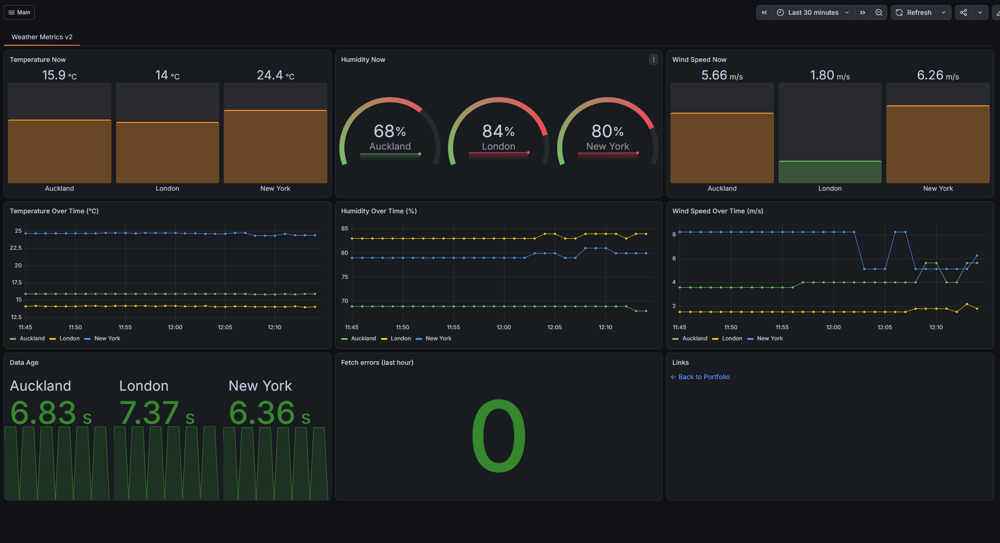
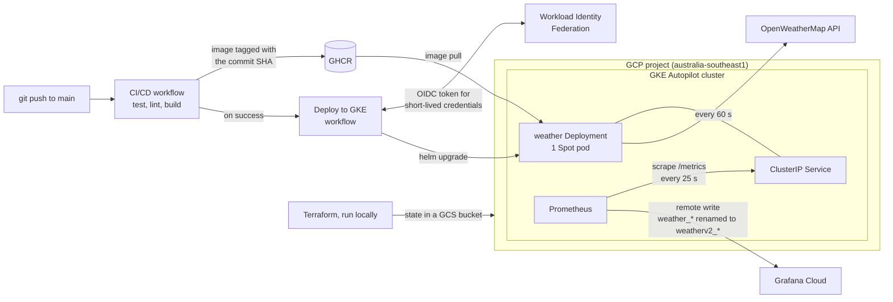

# Weather Metrics v2

A FastAPI service that fetches weather data from the OpenWeatherMap API every 60 seconds and exposes it as Prometheus metrics, forwarded to Grafana Cloud.

v2 runs the service on **Google Kubernetes Engine (Autopilot)**. The infrastructure is defined in **Terraform**, the app is packaged with **Helm**, and **GitHub Actions** deploys it using Workload Identity Federation, so no cloud credentials are stored anywhere.

v1, a Docker Compose deployment on an Oracle Cloud VPS, lives in [v-galkin/weather-metrics](https://github.com/v-galkin/weather-metrics). It is still running and was not changed while building v2.

## Dashboard



The first GKE session, step by step, with screenshots of two deliberate failure tests and one real outage: [docs/gke-session-2026-10-03.md](docs/gke-session-2026-10-03.md)

## Architecture



Nothing is exposed to the internet. The Service is ClusterIP only, so there is no load balancer; `kubectl port-forward` is used to reach the app directly.

## Tech stack

| Area | Tools |
|---|---|
| Application | Python 3.14, FastAPI, httpx, APScheduler, prometheus_client |
| Tests and linting | pytest (26 tests), respx, ruff, black |
| Dependencies | pip-tools: hand-written `.in` files, generated and fully pinned `.txt` files |
| Container | Docker, non-root user, published to GitHub Container Registry |
| Infrastructure | Terraform, Google provider 8.x, state in a versioned GCS bucket |
| Platform | GKE Autopilot, Spot pods, a custom VPC |
| Packaging | Helm: a custom chart for the app, the community chart for Prometheus |
| Observability | Prometheus (in the cluster), Grafana Cloud |
| CI/CD | GitHub Actions, Workload Identity Federation (keyless) |

## Repository layout

```
app/                    FastAPI application
tests/                  pytest suite
helm/
  weather-metrics/      Helm chart for the app (Deployment and Service)
  prometheus-values.yaml  values for the community Prometheus chart
infra/
  bootstrap/            Terraform, applied once: deployer service account and Workload Identity
  cluster/              Terraform, applied and destroyed each session: VPC, subnet, Autopilot cluster
.github/workflows/
  ci-cd.yml             test, lint, build and push the image
  terraform.yml         Terraform fmt and validate on pull requests
  deploy-gke.yml        keyless Helm deploy to GKE
grafana/                dashboard definition
docs/                   changes from v1 and architecture decision records
```

## How deploys work

1. **CI/CD** (`ci-cd.yml`) runs on every push and pull request to `main`: tests and linting run in parallel. On a push to `main`, the image is built and pushed to GHCR with two tags, `latest` and the full commit SHA.
2. **Deploy to GKE** (`deploy-gke.yml`) starts when CI/CD finishes on `main`. It deploys only if CI succeeded and the repository variable `GKE_ENABLED` is `true`, so pushes made while the cluster is down are skipped instead of failing. It can also be run by hand from the Actions tab, with any built image tag.
3. The deploy job logs in to Google Cloud with **Workload Identity Federation**: GitHub issues a short-lived OIDC token, and Google exchanges it for credentials that last about an hour. Only runs from this repository's `main` branch are accepted.
4. It runs `helm upgrade --install` with the commit's SHA tag and waits for the pod to become **ready**. Readiness (`/ready`) passes only after the app's first successful weather fetch, so a broken release, such as one with a wrong API key, fails the workflow instead of looking healthy.

The deployer service account has `roles/container.developer` only: it can deploy workloads but cannot create, change or delete the cluster.

**Terraform** is not run from CI. It is applied locally, and pull requests that change `infra/` are checked with `terraform fmt` and `terraform validate` (`terraform.yml`).

## Running a session on GKE

The cluster is created at the start of a session and destroyed at the end, so it only costs money while it is in use.

**One-time setup** (already done): a GCP project with billing and a budget alert, a versioned state bucket, `terraform apply` in `infra/bootstrap`, and the repository variables `GCP_WORKLOAD_IDENTITY_PROVIDER`, `GCP_DEPLOYER_SA`, `GCP_REGION` and `GKE_ENABLED`.

**Start:**

```powershell
cd infra/cluster
terraform apply
gcloud container clusters get-credentials weather-autopilot --region australia-southeast1

kubectl create namespace weather
kubectl -n weather create secret generic weather-secrets --from-literal=OPENWEATHER_API_KEY=<key>

kubectl create namespace monitoring
kubectl -n monitoring create secret generic grafana-cloud --from-literal=token=<grafana-token>
helm upgrade --install prometheus oci://ghcr.io/prometheus-community/charts/prometheus `
  --version 29.35.0 -n monitoring -f helm/prometheus-values.yaml --wait

gh variable set GKE_ENABLED --body "true"
```

Then deploy by running **Deploy to GKE** from the Actions tab, or by pushing to `main`.

**Stop:**

```powershell
gh variable set GKE_ENABLED --body "false"
cd infra/cluster
terraform destroy
gcloud container clusters list   # should list nothing
```

`infra/bootstrap` is never destroyed: Workload Identity pool IDs can't be reused for 30 days after deletion, and the GitHub variables depend on it.

## Cost controls

- **Autopilot:** billed for what the pods request, not for whole machines. The cluster management fee is covered by the GKE free tier for one cluster.
- **Spot pods:** both the app and Prometheus run on Spot capacity, which is much cheaper. An eviction only means a short restart; the first fetch runs immediately on startup.
- **No load balancer and no persistent disk:** the Service is ClusterIP only, and Prometheus forwards its data instead of storing it.
- **Only the app's metrics leave the cluster:** Prometheus forwards `weather_*` series only, keeping Grafana Cloud usage within the free tier.
- **Budget alert:** NZ$10 a month, with emails at 50%, 90% and 100%, calculated before credits.
- **Destroy after every session**, and check with `gcloud container clusters list`.

## Design decisions

- **One replica and the Recreate strategy.** Each replica polls the API on its own, so two would double the API calls and duplicate the metrics. A rolling update would briefly run two pods, so the Deployment uses Recreate.
- **Liveness and readiness are separate.** `/health` (liveness) only checks that the process is running. `/ready` (readiness) checks for the first successful fetch since startup. Later outages don't affect readiness: if they did, Kubernetes would stop routing to the pod and Prometheus would stop scraping it exactly when something was wrong. Problems after startup show up in the `weather_fetch_errors_total` and `weather_last_success_timestamp_seconds` metrics.
- **Two Terraform roots.** `bootstrap` (identity, permanent) and `cluster` (network and GKE, destroyed each session) have different lifecycles and separate state files, so destroying the cluster can never touch the identity resources.
- **A shared Grafana Cloud stack.** The free trial allows one stack, which v1 already uses. Prometheus renames v2's metrics to `weatherv2_*` when sending them, so v1's dashboard and alerts are unaffected. Details: [docs/changes-from-v1.md](docs/changes-from-v1.md#v2-shares-the-grafana-cloud-stack-without-affecting-v1).
- **Region `australia-southeast1` (Sydney).** The closest region available to the project; no New Zealand region was available yet.

Architecture decision records are in [docs/adr](docs/adr).

## What changed since v1

- [The public route no longer creates metrics](docs/changes-from-v1.md#the-public-route-no-longer-creates-metrics)
- [One bad API response no longer stops the whole update](docs/changes-from-v1.md#one-bad-api-response-no-longer-stops-the-whole-update)
- [Weather data is available as soon as the app starts](docs/changes-from-v1.md#weather-data-is-available-as-soon-as-the-app-starts)
- [The fetch interval can be changed without a new build](docs/changes-from-v1.md#the-fetch-interval-can-be-changed-without-a-new-build)
- [Every dependency is pinned to an exact version](docs/changes-from-v1.md#every-dependency-is-pinned-to-an-exact-version)
- [Every image can be traced to its commit](docs/changes-from-v1.md#every-image-can-be-traced-to-its-commit)
- [The container no longer runs as root](docs/changes-from-v1.md#the-container-no-longer-runs-as-root)
- [Local runs no longer send data to the live dashboard](docs/changes-from-v1.md#local-runs-no-longer-send-data-to-the-live-dashboard)
- [A readiness check shows whether the app actually works](docs/changes-from-v1.md#a-readiness-check-shows-whether-the-app-actually-works)
- [Metrics show whether fetching is working](docs/changes-from-v1.md#metrics-show-whether-fetching-is-working)
- [An unknown city no longer stops the whole update](docs/changes-from-v1.md#an-unknown-city-no-longer-stops-the-whole-update)
- [v2 shares the Grafana Cloud stack without affecting v1](docs/changes-from-v1.md#v2-shares-the-grafana-cloud-stack-without-affecting-v1)

Each change, with the problem, the fix and the test that covers it: [docs/changes-from-v1.md](docs/changes-from-v1.md)

## Running locally

Create a `.env` file in the project root with your own [OpenWeatherMap API key](https://openweathermap.org/api):

```
OPENWEATHER_API_KEY=your_key_here
```

1. **Create a virtual environment**
   ```
   python -m venv venv
   ```

2. **Activate it**

   Windows (PowerShell):
   ```
   venv\Scripts\Activate.ps1
   ```
   If PowerShell says running scripts is disabled, allow local scripts once, then activate again:
   ```
   Set-ExecutionPolicy -Scope CurrentUser RemoteSigned
   ```

   macOS / Linux:
   ```
   source venv/bin/activate
   ```

   The prompt starts with `(venv)` while the environment is active. Run `deactivate` to leave it.

3. **Install the dependencies**
   ```
   pip install -r requirements-dev.txt
   ```

4. **Run the application** (at `http://localhost:8000`)
   ```
   uvicorn app.main:app --reload
   ```

5. **Run the tests and linters**
   ```
   pytest -v
   ruff check .
   black --check .
   ```

**With Docker Compose** (the app plus a local Prometheus at `http://localhost:9090`, which sends nothing to Grafana Cloud):

```
docker compose -f docker-compose-dev.yml up --build
```

**On a local Kubernetes cluster** with [kind](https://kind.sigs.k8s.io/):

```
kind create cluster --name weather
kubectl create namespace weather
kubectl -n weather create secret generic weather-secrets --from-literal=OPENWEATHER_API_KEY=<key>
helm upgrade --install weather helm/weather-metrics -n weather --set nodeSelector=null --wait
kubectl -n weather port-forward svc/weather 8000:8000
```

`--set nodeSelector=null` removes the GKE Spot setting, since kind has no Spot nodes.
