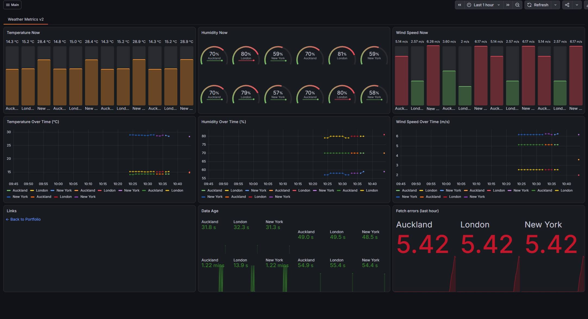
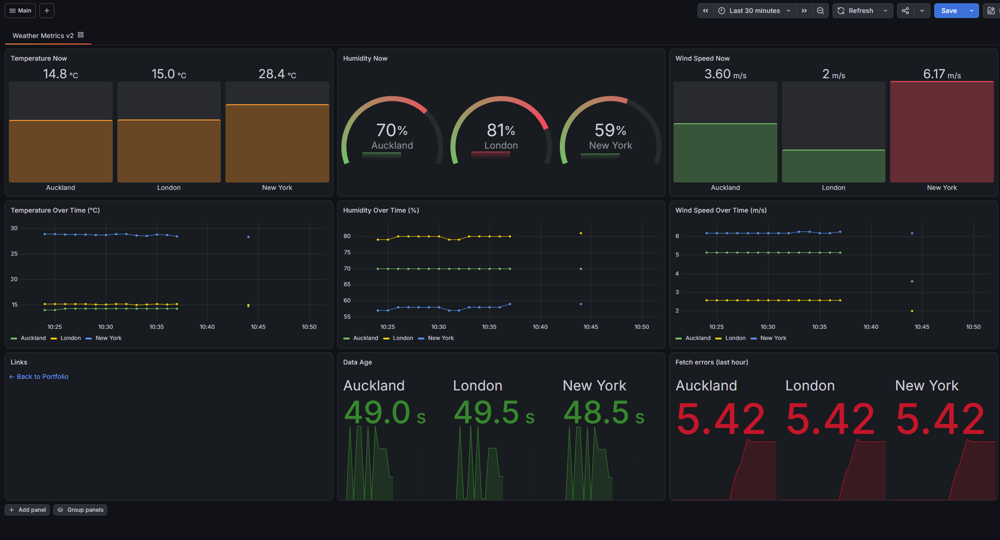
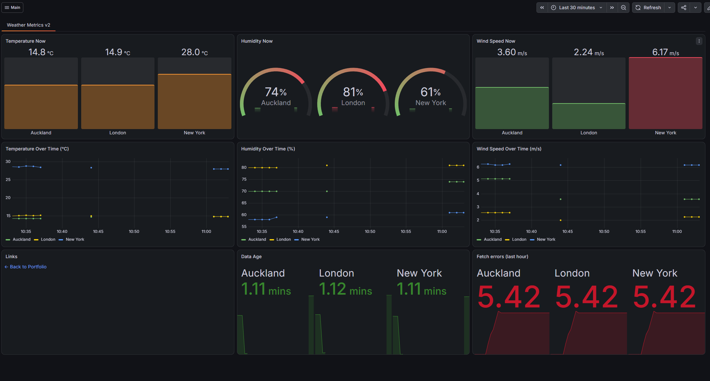
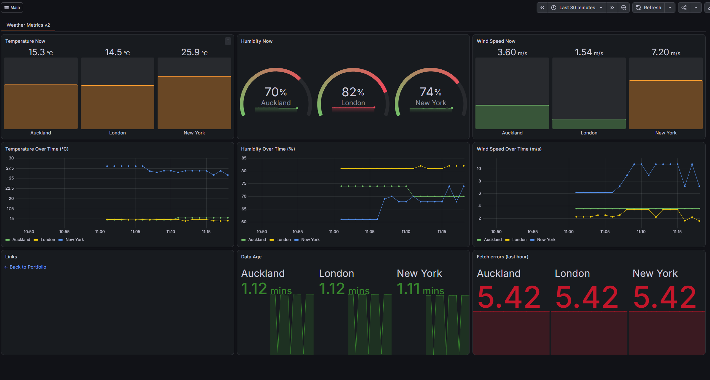
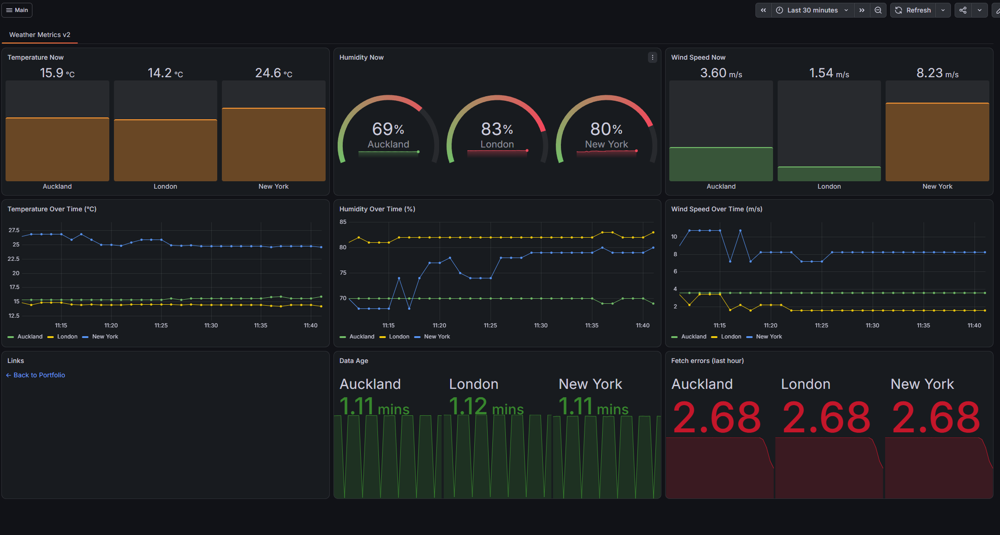
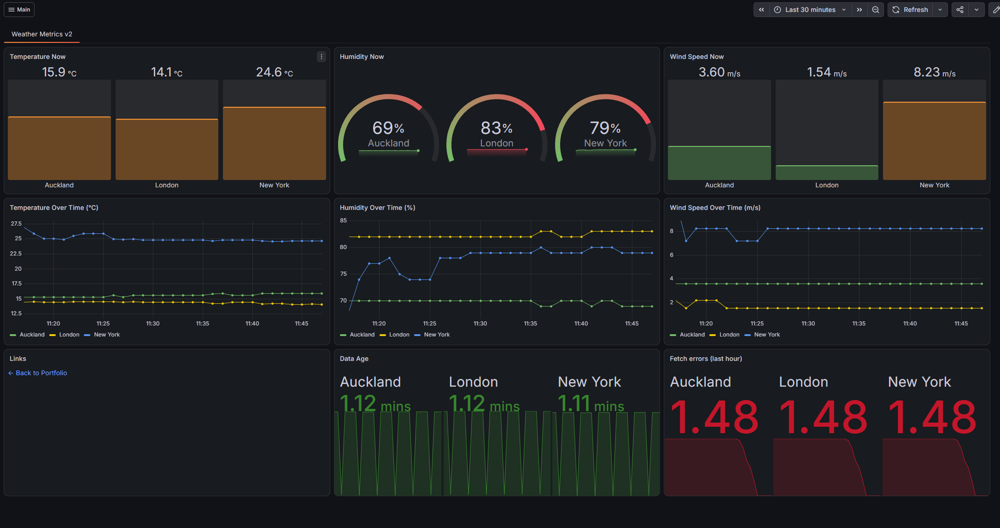

# First GKE session: dashboard history (3 October 2026)

The first full session of v2 on GKE, from the first deploy to a healthy, automatically deployed service. The screenshots show the "Weather Metrics v2" dashboard in Grafana Cloud at each stage, including two deliberate failure tests and one real mistake.

Times are New Zealand time.

## Timeline

| Time | Event |
|---|---|
| 09:50 | `terraform apply` creates the VPC, subnet and Autopilot cluster |
| 09:57 | Prometheus installed; it waits about 5 minutes while Autopilot creates a Spot node (the first scale-up attempt failed on the project's 12-vCPU quota and was retried with a smaller machine) |
| 10:08–10:18 | First manual deploy. Two mistakes, both caught: a placeholder image tag (`InvalidImageName`) and a placeholder API key (the pod never became ready). A placeholder Grafana token also stopped remote write until it was replaced |
| 10:31 | First deploy by GitHub Actions with Workload Identity Federation (manual run) |
| 10:35 | First automatic deploy: a push to `main` is tested, built and deployed with no manual step |
| 10:37 | **Test:** deploy with a broken API key. The pod never passes `/ready`, and the workflow fails after 5 minutes, as intended |
| 10:43 | The key is restored and the current commit redeployed |
| 10:44 | **Real mistake:** a deploy with the image tag `…b813clear` (a stray word typed onto the commit SHA). The image doesn't exist, the workflow fails, and because nothing rolled back, the app stays down |
| 10:59 | Fix: `--rollback-on-failure` added to the deploy workflow. The push deploys automatically and restores the app |
| 11:45 | The test failures leave the dashboard's one-hour error window: all panels green |

## Screenshots

### 1. One set of series per pod

Each deploy created a new pod with a new IP address, and Prometheus labels every series with the pod's address (`instance`) and node. Each pod therefore produced its own series, and the "Now" panels showed one value per city for every pod in the time range.

**Fix:** the dashboard queries combine series by city, for example `max by (location) (weatherv2_temperature_celsius{cluster="gke"})`, and `sum by (location) (...)` for the error counter.

### 2. Gaps from the failed deploys

One line per city after the fix. The gap from 10:37 is the broken-key test. With one replica and the Recreate strategy, the working pod is stopped before the new one starts, so a deploy that never becomes ready leaves a gap in the data.

### 3. The outage from the bad image tag

From 10:44 to 11:01 there is no data: the pod couldn't pull the image `…b813clear`. The workflow correctly reported the failure, but Helm didn't roll back, so the app stayed down until the next successful deploy. This led to adding `--rollback-on-failure` to the deploy workflow.

### 4. Recovered after the rollback fix

The commit that added `--rollback-on-failure` was itself deployed automatically and brought the app back. Data flows again from 11:01. "Fetch errors (last hour)" still counts the failures from the broken-key test.

### 5 and 6. Errors leaving the one-hour window

Continuous data for all three cities. "Fetch errors (last hour)" uses `increase(...[1h])`, so the test failures count less as they move out of the window (2.68, then 1.48). "Data age" stays between 0 and about 90 seconds: up to 60 seconds between fetches, plus up to 25 seconds until the next scrape.

### 7. All healthy: 30 minutes of normal operation

The last 30 minutes of the session, after the test failures left the one-hour window: continuous data for all three cities, data age under 90 seconds, and no fetch errors. This is what the dashboard looks like in normal operation.

## What changed because of this session

- **Automatic rollback:** the deploy workflow uses `helm upgrade --rollback-on-failure`, so a failed deploy restores the last working revision instead of leaving the app down.
- **Dashboard queries aggregated by city**, so redeploys don't multiply the series on the dashboard.
- **Two new panels** that make problems visible: "Data age" (`time() - weatherv2_last_success_timestamp_seconds`) and "Fetch errors (last hour)".
- **Safer commands:** values are taken from their source instead of edited placeholders: `$(git rev-parse HEAD)` for the image tag, the `.env` file for the API key, and a hidden `Read-Host` prompt for the Grafana token.
